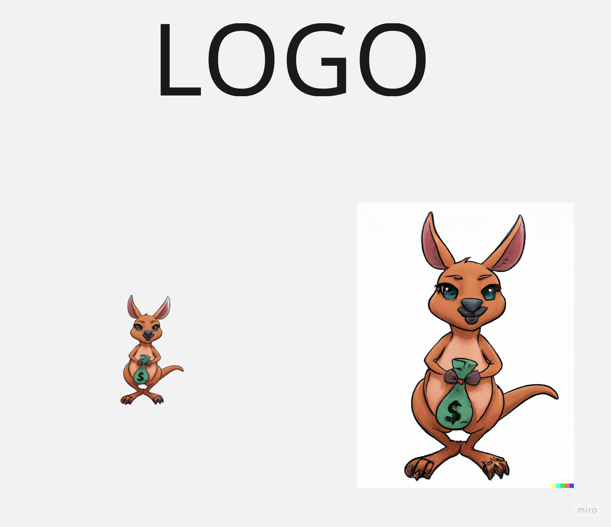
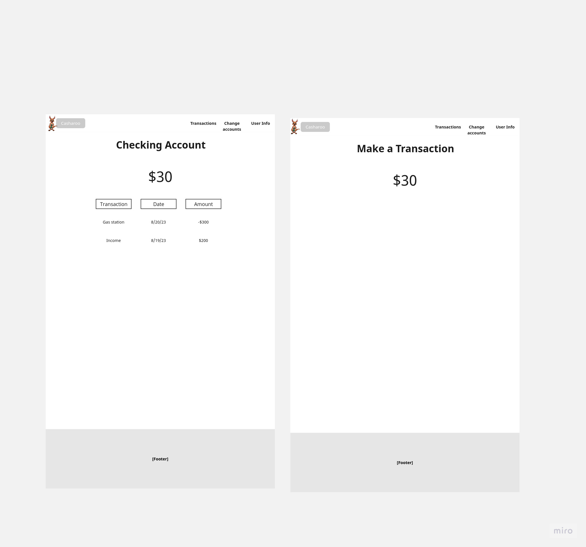
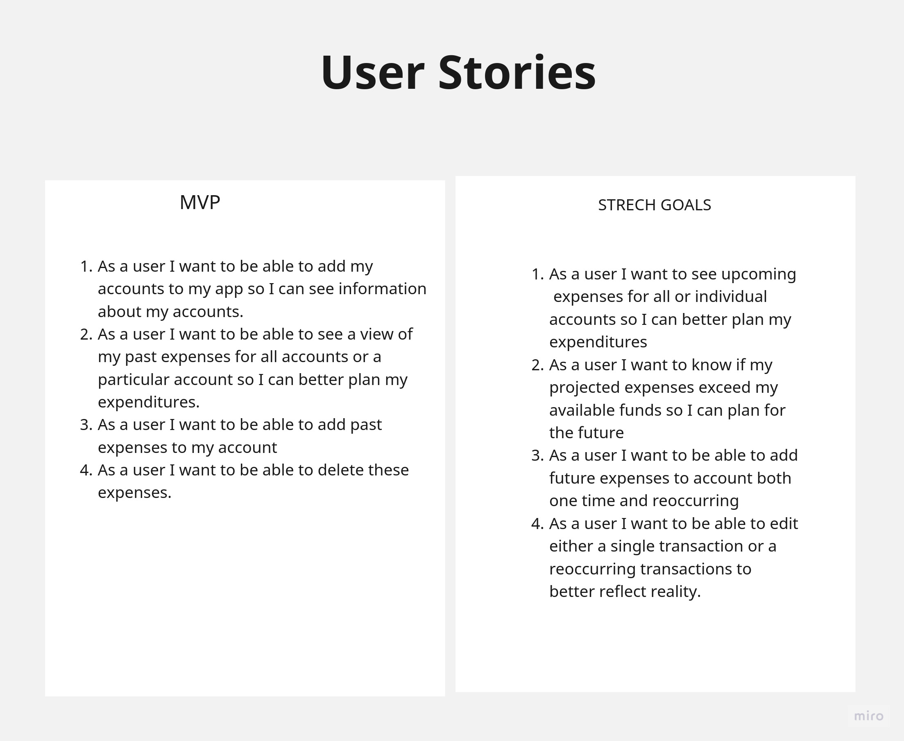
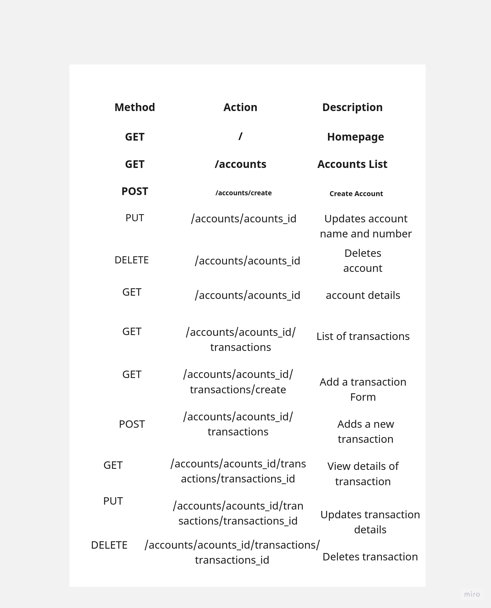

# Description
Casheroo is a user-friendly personal finance app that centralizes your financial data. By adding multiple accounts, users get a full view of their recent spending and total balance. The app tracks your current expenses and gives forecasts of your future spending. This keeps users well-informed and helps manage their money better.
# UI

## Logo

## Wireframes

### Before Login

### Logged in

### Account and Transaction View

# User Stories

# Implimentation

### ERD

### Routes

